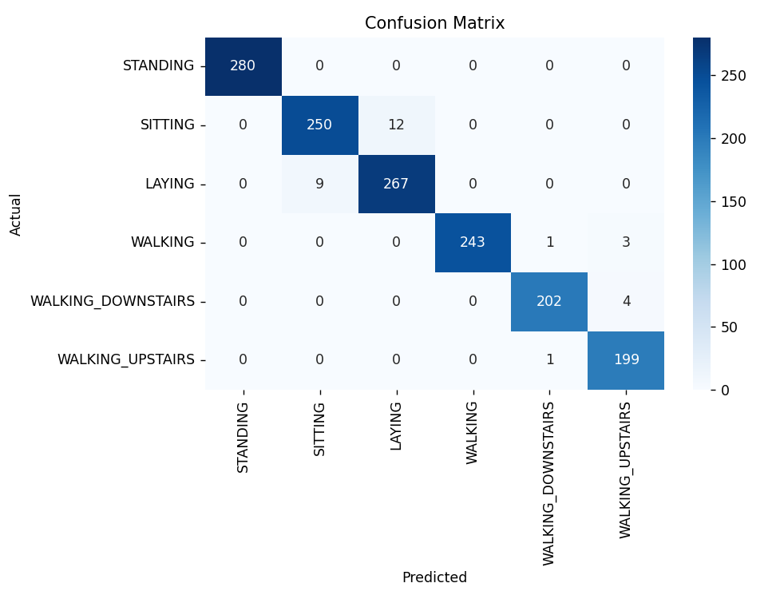
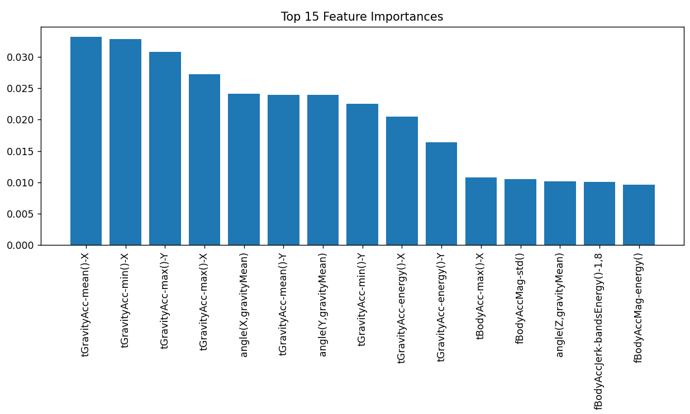

# Human Activity Recognition (HAR) 🏃‍♂️📱  
A machine learning project that classifies human activities using smartphone sensor data.  
It uses **Random Forest Classifier** from Scikit-learn with feature importance analysis and performance visualization.  


## Features  
- Classifies activities such as **Walking, Sitting, Standing, Laying, Walking Upstairs, Walking Downstairs**  
- Uses **Random Forest** for robust and accurate classification  
- Evaluates the model using **accuracy, precision, recall, f1-score**  
- Provides a **detailed classification report** for per-class metrics  
- Visualizes performance with Confusion Matrix heatmap and Feature Importance bar chart  


## Dataset  
- Dataset used: `HAR.csv` (preprocessed Human Activity Recognition dataset)  
- Features: multiple smartphone accelerometer and gyroscope measurements  
- Target column: `Activity` (categorical labels for human actions)  


## Model Evaluation Metrics  
- **Accuracy** → ratio of correct predictions to total predictions  
- **Precision** → proportion of correctly predicted samples for each activity  
- **Recall** → proportion of actual activities correctly classified  
- **F1 Score** → harmonic mean of precision and recall  
- **Confusion Matrix** → visual representation of classification performance across all activity classes  


## Results  
***Example run produced the following results:***  
```
Accuracy: 97.96%
Precision: 97.97%
Recall: 97.96%
F1 Score: 97.96%

Classification Report:

                   precision    recall   f1-score   support
LAYING                1.00       1.00      1.00       280
SITTING               0.97       0.95      0.96       262
STANDING              0.96       0.97      0.96       276
WALKING               1.00       0.98      0.99       247
WALKING_DOWNSTAIRS    0.99       0.98      0.99       206
WALKING_UPSTAIRS      0.97       0.99      0.98       200

accuracy                                   0.98       1471
macro avg             0.98       0.98      0.98       1471
weighted avg          0.98       0.98      0.98       1471
```

## Visualizations  

### Confusion Matrix  
Shows how well the model predicts each activity.  
  

### Top 15 Feature Importances  
Highlights the most influential features in classification.  
  


## How It Works  
1. Load and preprocess the dataset (`HAR.csv`)  
2. Split data into **train (80%)** and **test (20%)** sets  
3. Train a **Random Forest Classifier** with 200 trees  
4. Predict activities on the test set  
5. Evaluate using multiple metrics  
6. Visualize results with Confusion Matrix heatmap and Feature Importance bar chart  

## Outcome  
- Achieved **~98% accuracy** on test data  
- Reliable classification across **6 human activities**  
- Feature importance plot highlights most influential signals  
- Provides a reusable and extendable ML pipeline for HAR tasks  

## Future Improvements  
- Add cross-validation to further validate performance  
- Compare Random Forest with **other classifiers** (SVM, XGBoost, Neural Networks)  
- Apply dimensionality reduction (PCA) for faster training  
- Deploy as a **real-time activity recognition app** on mobile devices  