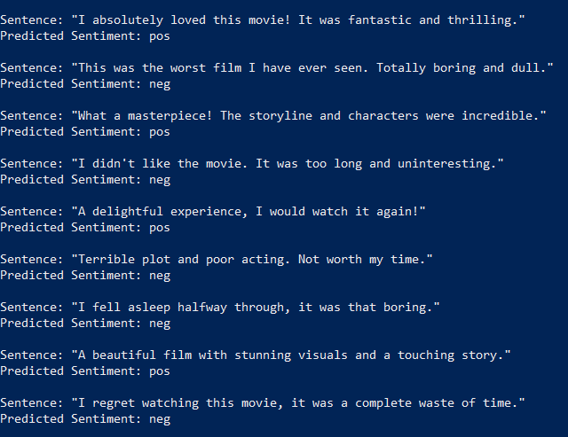
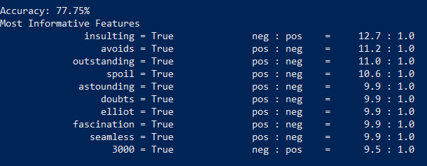

# Sentiment Analysis on Text Data 🎭  
A Natural Language Processing (NLP) project that classifies text data into **positive** and **negative** sentiments using **NLTK (Natural Language Toolkit)**.  

This project demonstrates how machine learning and text preprocessing techniques can be applied to analyze movie reviews and predict their sentiment.  

## Features  
- Classifies text data as **Positive (pos)** or **Negative (neg)**  
- Uses **NLTK** for text processing and sentiment classification  
- Implements **Naive Bayes Classifier** for effective sentiment prediction  
- Provides **most informative features** influencing classification  
- Achieves competitive accuracy on test data  

## Model Evaluation Metrics  
- **Accuracy** → Percentage of correctly classified sentences  
- **Most Informative Features** → Key words that strongly influence classification  

## Results  

### Example Predictions  
- The model correctly identifies the sentiment of example sentences:  

### Model Accuracy & Features

- Achieved **77.75% accuracy** on the test set
- Top informative features highlight words that strongly indicate sentiment polarity

## ⚙️ How It Works

1. Load and preprocess text data
2. Tokenize and clean sentences using **NLTK**
3. Extract features for classification
4. Train a **Naive Bayes Classifier**
5. Test on new data and evaluate accuracy
6. Display most informative features

## Outcome

- Achieved \~77.75% accuracy on test data
- Successfully classifies sentences into positive or negative sentiment
- Provides insights into the most influential words for sentiment detection

## Future Improvements

- Experiment with advanced models (Logistic Regression, SVM, Deep Learning)
- Use **word embeddings (Word2Vec, GloVe, BERT)** instead of bag-of-words
- Apply on larger and more diverse datasets
- Deploy as a web app for real-time sentiment analysis

